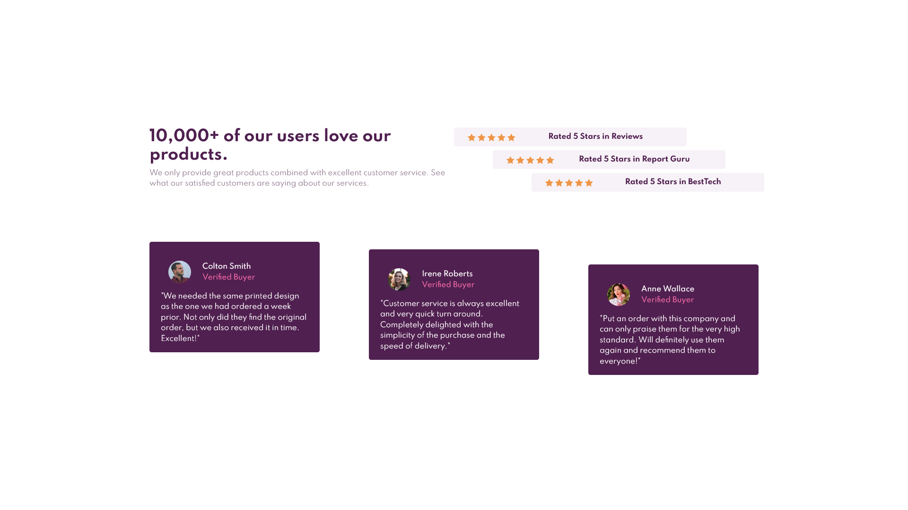

# Frontend Mentor - Social proof section solution

This is a solution to the [Social proof section challenge on Frontend Mentor](https://www.frontendmentor.io/challenges/social-proof-section-6e0qTv_bA). Frontend Mentor challenges help you improve your coding skills by building realistic projects. 

## Table of contents

- [Overview](#overview)
  - [The challenge](#the-challenge)
  - [Screenshot](#screenshot)
  - [Links](#links)
- [My process](#my-process)
  - [Built with](#built-with)
  - [What I learned](#what-i-learned)
- [Author](#author)

## Overview

### The challenge

Users should be able to:

- View the optimal layout for the section depending on their device's screen size

### Screenshot

### Links

- Solution URL: [My Solution](https://github.com/Z-ayat/Social-proof-section-challenge)
- Live Site URL: [My live site](https://z-ayat.github.io/Social-proof-section-challenge/)

## My process

### Built with

- Semantic HTML5 markup
- CSS custom properties
- Flexbox
- CSS Grid
- Mobile-first workflow
- [Bootstrap 5](https://getbootstrap.com/) - Bootstrap library

### What I learned

- When developing a website with bootstrap u should go with mobile first.
- Also starting over the project is much better and painless than debugging alot of problems :D

### Continued development

- Mobile-First workflow

## Author

- Website - [Ali El-Zayat](No Site yet)
- Frontend Mentor - [@Z-ayat](https://www.frontendmentor.io/profile/Z-ayat)
- Twitter - [@AliElZayat9](https://twitter.com/AliElZayat9)
